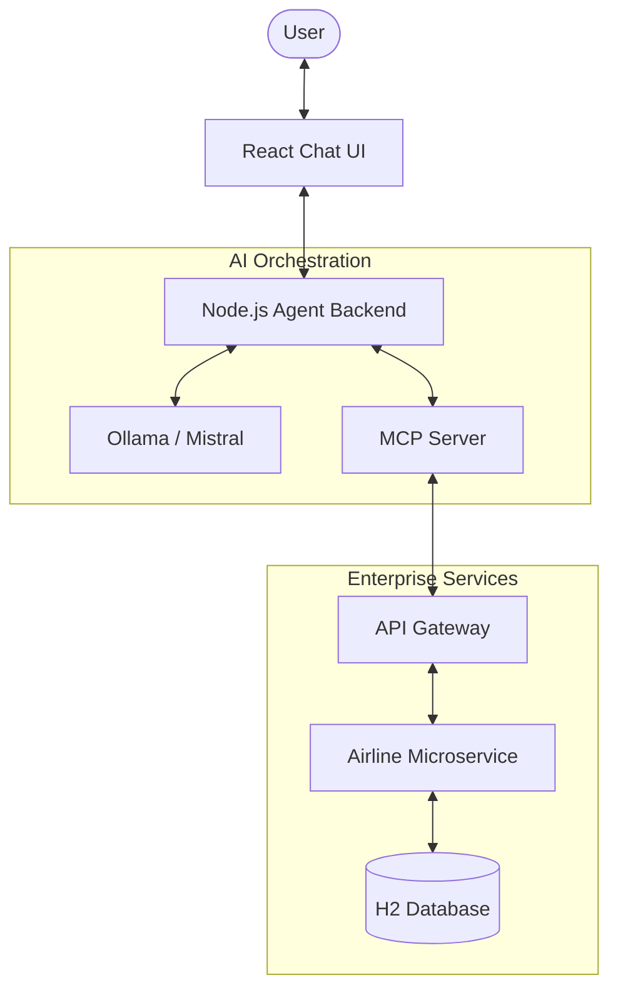

# SE4458 - Assignment 2: AI Agent Chat Application ✈️

**Student Name:** Barış Hansu  
**Project Theme:** Airline API (Query Flight, Book Flight, Check-in)  

---

## 📖 Project Overview
This project extends a multi-service Airline API by introducing an intelligent conversational interface. Using the **Model Context Protocol (MCP)**, the AI Agent enables users to search for flights, book tickets, and perform check-ins through natural language interaction. It demonstrates the seamless integration of local Large Language Models (LLMs) with traditional microservice architectures.

## 🏗️ Core Architecture
The system is built on a multi-layered stack designed to decouple AI orchestration from core business logic:



## 🛠️ Technology Stack

| Layer | Component | Technology |
| :--- | :--- | :--- |
| **Frontend** | Chat Interface | React, Vite, Lucide Icons, Axios |
| **Intelligence** | LLM Engine | Ollama (Mistral 7B) |
| **Orchestration** | Agent Backend | Node.js, Express, MCP SDK |
| **Connectivity** | Core Protocol | Model Context Protocol (Stdio) |
| **Infrastructure** | Gateway & API | Java Spring Boot, Spring Cloud Gateway |

## 💡 Design Decisions & Assumptions
- **Local LLM Deployment:** We utilized a local LLM (**Mistral** via Ollama) to eliminate external API costs and latencies while ensuring data privacy, as permitted by the assignment guidelines.
- **Unified MCP Flow:** The backend utilizes the official MCP SDK with Stdio transport. This allows the Agent Backend to manage the MCP Server lifecycle locally, enabling dynamic tool discovery and mapping into the LLM system.
- **Stateless Microservices:** The API Gateway and Airline microservice remain stateless, with the Chat Agent handling conversation history to maintain system scalability.
- **Authentication:** To focus on the AI functional capabilities, authentication is handled via a simplified token schema (`Bearer Agent-Token`) passed through the Gateway.

## ⚠️ Issues Encountered
- **Dynamic Tool Mapping:** Transforming strict JSON Schemas from the MCP definitions into a format natively understood by Mistral's function-calling mechanism required building a custom dynamic schema translator.
- **Hallucination Management:** Small-scale local models can sometimes "hallucinate" tool calls. We implemented a robust regex-based fallback system in the Agent Backend to capture and normalize these calls before execution.
- **Streaming State Synchronization:** Implementing typewriter effects in the UI while handling asynchronous tool results required precise promise management between Express and React.

## 🚀 Setup & Installation

### 1. Prerequisites
- [Ollama](https://ollama.com/) installed and running.
- Java 17+ and Maven.
- Node.js (v18+).

### 2. Prepare the LLM
```bash
ollama pull mistral
```

### 3. Start Core Services (Spring Boot)
Launch the Airline Microservice and the API Gateway:
```bash
# In /airline-api
mvn spring-boot:run

# In /api-gateway
mvn spring-boot:run
```

### 4. Start the AI Agent (Node.js)
```bash
cd agent-mcp-server
npm install
node agent.js
```

### 5. Launch the Frontend
```bash
cd chat-frontend
npm install
npm run dev
```

## 🔗 Project Links
- **Presentation Video:** [Watch Project Demo on YouTube](https://youtu.be/aVwDCfvFbsI)
- **Source Code:** 
  - [Airline Backend API](https://github.com/barishansu45/airline-api)
  - [API Gateway](https://github.com/barishansu45/api-gateway)

---
*Developed for SE4458 - Software Architecture Assignment.*
