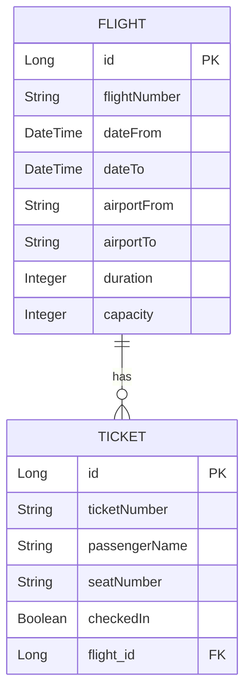

# ✈️ Airline Management System (Group 1 - SE 4458 Midterm)


> **High-performance Airline Ticketing API** built with Spring Boot & Spring Cloud Gateway using **Service-Oriented Architecture (SOA)**.

🚀 **[Live Swagger UI](https://airline-api-project-e0h2dwbpgyh3h3d8.germanywestcentral-01.azurewebsites.net/swagger-ui/index.html)** | 🛡️ **[API Gateway Repository](https://github.com/barishansu45/api-gateway)** | 🎥 [**[Demo Video](#)**](https://www.youtube.com/watch?v=sHMSK8gfKck)

---

### 📢 Important Note
This project strictly follows **SOA principles**. The core business logic is located in this repository, while security, authentication, and rate-limiting are managed by a **separate** API Gateway service.

---

## 🏗️ Architecture & Design

This system follows a **Service-Oriented Architecture (SOA)** to ensure scalability and separation of concerns:

- **API Gateway (Port 8081):** Handles Authentication checks and Rate Limiting (3 requests/day).
- **Backend Service (Port 8080):** Manages core Business Logic, CRUD operations, and Database interactions.

### 🛠 Tech Stack
- **Language:** Java 17
- **Framework:** Spring Boot 3.x, Spring Cloud Gateway
- **Database:** PostgreSQL (Azure Managed)
- **Testing:** k6 (Performance), Postman (API)

---

## 🏗️ Design, Assumptions & Issues

### Assumptions
* **Seat Assignment:** A unique numbering system (e.g., Seat-1) is assigned during check-in.
* **Capacity Logic:** Flight capacity decreases by 1 for each ticket sold. Returns "Sold Out" when capacity hits 0.
* **Pagination:** Query results are paginated with a default size of 10.

### Issues Encountered
* **CSV Bulk Upload:** Encountered formatting issues with date-time fields during file processing. This was resolved by enforcing the ISO 8601 standard.
* **Rate Limiting:** Implementing the "3 calls per day" limit required a custom filter in the Gateway to track user requests accurately.

---

## 🗄️ Database Design (ER Diagram)



**Visual Representation:**
<br>


---

## 📊 Load Testing Results (k6)

### 🎯 Tested Endpoints
To comprehensively evaluate the system's performance, all core API endpoints were subjected to the load test. The primary focus was on:
* **`GET /api/v1/flights/query`** : High-traffic read operations.
* **`POST /api/v1/flights/buy-ticket`** : Concurrent write operations.
* **`GET /api/v1/flights/{id}`** : Fetching specific flight details.
* **`POST /api/v1/flights/upload`** : Bulk CSV data processing.

* **k6 Test Script File:** [`load-test.js`](./load-test.js)
* **k6 Test Data (CSV):** [k6testing.csv](https://github.com/user-attachments/files/26348014/k6testing.csv)

| Scenario | VU | Duration |
| :--- | :--- | :--- |
| Normal Load | 20 | 30s |
| Peak Load | 50 | 30s |
| Stress Load | 100 | 30s |

### Performance Metrics
- **Average Response Time:** 64.17 ms
- **95th Percentile (p95):** 86.36 ms
- **Requests Per Second:** ~21.5 req/s
- **Error Rate:** 0%

<br>


### Analysis
The API maintained stable performance even under the 100 VU Stress Load, with response times consistently under 100ms. The API Gateway successfully routed traffic without causing any bottlenecks. To further enhance scalability, a distributed caching layer (like Redis) could be implemented for frequent flight queries.

---

## 🔐 Security & Rate Limiting

- **Unauthorized Requests:** Returns **401 Unauthorized**.
- **Rate Limit Exceeded:** Returns **429 Too Many Requests**.
- **Rule:** Max 3 requests per day per user (Handled at Gateway level).

**401 Proof:**
<br>


**429 Proof:**
<br>


---

## ▶️ How to Run

1. **Clone the repository:**
```bash
git clone https://github.com/barishansu45/airline-api
```
2. **Run the Backend:**
```bash
cd airline-api
./mvnw spring-boot:run
```
3. **Run the Gateway:**
   - Go to the API Gateway Repository and follow its instructions.

---

## 🚀 Future Improvements
- [ ] Redis caching for flight queries.
- [ ] Advanced seat allocation logic (Aisle/Window).
- [ ] Implementation of a full OAuth2/OIDC Authentication system.
